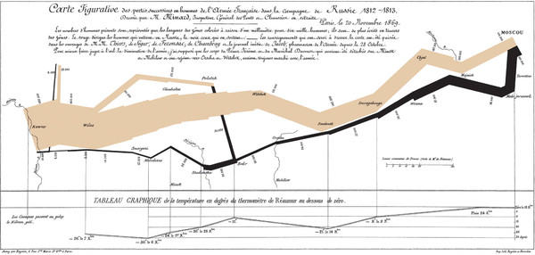

# iPanda

这是一个用来收集网络上给人以启迪的图像项目。

## Example

这是一张十分著名的拿破仑行军图，在一张图里面记载了六种数据：拿破仑军队的人数、行军距离、温度、经纬度、移动方向、以及时间－地域关系。

## You can see

* [不想返工兽the panda does not want to work](/the_work_panda_story)
* [我虎车死me tiger car die](/the_cat_open_the_car)
* [平衡之笼balanced cage](/balanced_cage)
